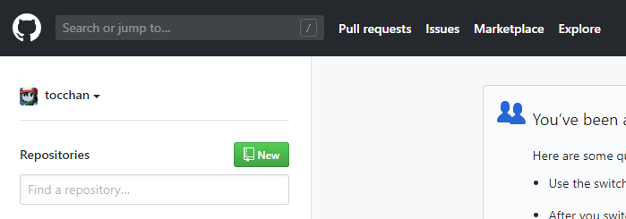
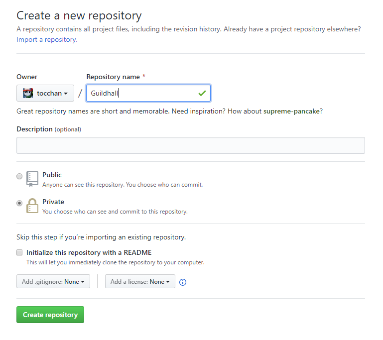
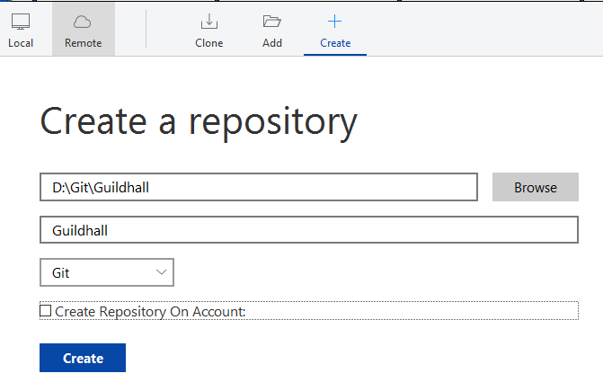
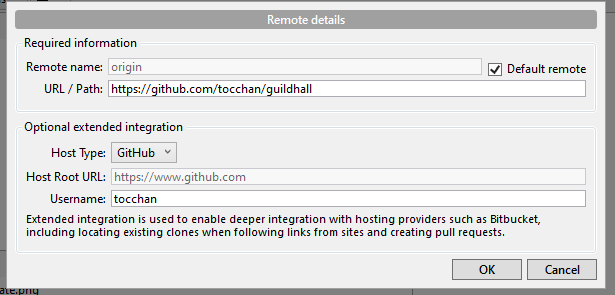
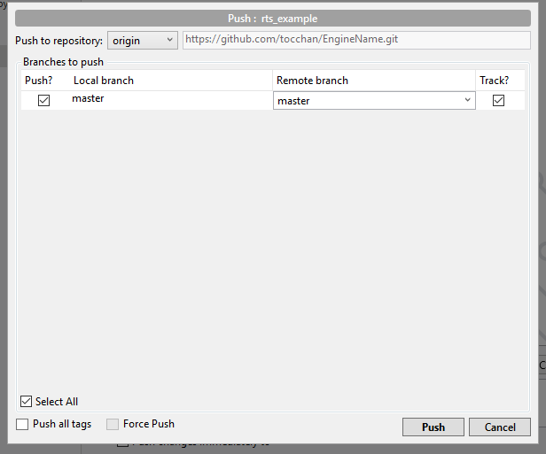
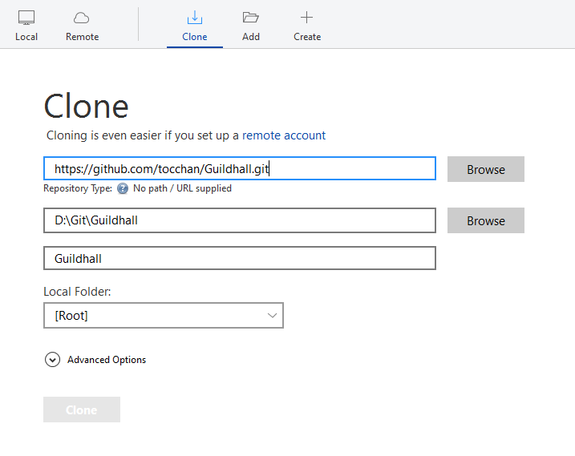

GIT Setup
======

## Overview
Basic structure is we're going to make a repot per project, and have a branch per assignment turn in. 

We're also going to have a repot for our Engine and incorporate this into our projects as a submodule, allowing different projects to point to different versions of the Engine more easily.  

This will require that we restructure our Game/Engine relationship by having our Engine be within the Game projects folder structure.  

## Walkthrough

### Create a GitHub account
There are other possible hosts to use, but github has a free student account that allows you to create unlimited private repots, as well as it is the service I use for grading.

Next, sign up for a student account.
https://education.github.com/pack

### Create 2 New Repots (Engine & Protogame)
We will leave them empty for now; 

First, go to your homepage in GitHub, and select Repositories, and click "New".

Next, create your Repot. 

### (Optional) Download Atlassian SourceTree
To make this easier - I recommend getting this GUI client for Git.
https://www.sourcetreeapp.com/

There are others, including Visual Studio has an integration, but I prefer this one, as it exposes more of Git functionality, as well as a console for when you have to do somtehing more specialized (which we'll be doing with submodules).

### Prepare your Project
Make your Protogame project.  Just copy into a new folder, preferably not under your P4 workspace.  

Open up SourceTree, and create a new repot, and point it at this folder.

This is setting up Git to track this folder.  Now, Git is purely a local source control, that can be mirrored on a service like github.  Currently, we just have a local repot.  Next we're going to make our initial commit, and this push it to our remote host.  Only once this is done are our changes backed up. 

### Initial Commit
After you created your project, you should be brought to a screen that looks like the following; 

The left side shows our current working branch - we'll get more into that later. 

Up top is Staged files, these are files to be commited (like a changelist in P4). 

Below that is Unstaged files.  These are files that have been edited from either what is currently commited, or what is in staged files.  You will likley see a lot of files here that you don't want to track.    

Now, git works reactively unlike P4 - it will automatically track changed files (added, removed, edited, etc...).  This means we a way to tell Git to ignore certain files, and we do this with a .gitignore file. 

Download and copy this [.gitignore](gitignore_example.txt) file to your root folder, and rename it to ".gitignore".  This file helps git figure out what files do not need to be tracked.  

Go back to sourcetree, and Unstaged files should now show a `.gitignore` file near the top and you should see less files.  If you see files you don't want ot track, you can write click and select "Ignore", and either ignore just that file, that extension, or that folder.  If you need more rules, the `.gitignore` file is plain text, that applies rules top to bottom (so you can ignore all, then stop ignoring a specific file). 

Once you're happy that only the files you want tracked are in Unstaged, select "Stage All", write a commit message (bottom part of that window), and select Commit.  

### Tie it to a Remote Repot
Now, we only have this commit locally.  This has the benefit of allowing you to work offline, but it means it is not backed up until we push to remote.  

Currently, our repot isn't tied to a remote branch, so we're going to add a remote branch; 

Select Repository from the top of SourceTree, and select Repository Settings, and select add. 

Next, go to your github page, and find your repots git address;

Copy this to your clipboard, and go back to SourceTree.  Put this into the URL/Path, and select "Default Remote", ie, the origin. 

Click OK. 

You should see "origin" appear until Remotes on the left side.  Next, we're going to tie "master" to this.  So right-click on **master** (it should be bold as this is your current branch), and select "push to", and select origin. Click Push. 

This will tie the local repot to the remote repot.  Click Push.  

Go to your github page and you should see it updated.

### Test
You can now pull this remote repot to any other folder on your machine, to make a buddy build.  This should be your Engine, and it should be able to compile by itself.  

So go to SourceTree, and we're going to open a new tab and clone a repot.  All you need is your git link that you used in the above step.  

Once cloned, you should be able to navigate to that folder, and compile.  If all went well, you should still be able to compile your Engine. 

### Protogame and Submodules
Repeat the above steps for your Protogame.  This should not compile as your project depends on Engine being in a folder relative to Protogame (usually pu the tree and back down). 

This doesn't work with Git unless your users know to pull both projects relative to each other.  A better way with Git is to put your Engine as a submodule of your game (ie, your game depends on Engine).  This allows your engine to exist under protogame, but is tracked seperately.

To do this, Under your Protogame root, add a new folder called "Submodules". If you want to try doing this by command line, you can follow this tutorial;
https://git-scm.com/book/en/v2/Git-Tools-Submodules

You can also do this through SourceTree, by going to your Protogame project, and select Repository > Add Submodule.  Use the git link as the URL, and give it the path "Submodule/Engine" for example.  

This repot now lives under Protogame, but is tracked seperately.  You can select the Submodule from the left side to open it.  

### Fix up Engine Links
Protogame is now pointing to an Engine that now longer exists.  You have to go now and manually fix up the links so Protogame compiles.  Once this is all done, commit and push the changes.  

### Common Pitfalls
#### Headless Branches
It can happen that your branch becomes "headless", meaning not pointing to an official branch.  If this happens, you'll notice no branch on the left side of SourceTree is in bold.

This is a great way to lose work, so if you notice this, do not change branches, as you will lose the progress you made in your headless branch.  Instead, you want to branch your headless branch into a new head to give it a name.  

Once this is done, you can merge it back into master, and then switch to master.  Master should now be bold, and you can push the changes.

#### Don't Forget to Push
All changes are local only.  So be sure, once you're about to call it a day, to push your changes to the remote branch.  Otherwise I will not be able to pull it, and more importantly, you will lose the work if something happens to your computer.   

